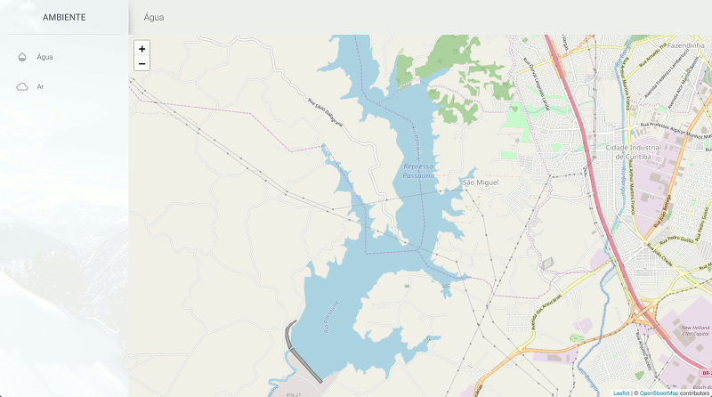

# Ardeidae

Esboço da interface de uma plataforma colaborativa para monitoramento da qualidade do ar e da água.

## Desenvolvimento

- Ubuntu: `sudo apt-get install nodejs` MacOS: `brew node`
- `npm install`
- `npm install gulp-cli -g`
- `npm install gulp -D`
- `gulp watch`

## Créditos

- Template material-design por Creative Tim (https://github.com/creativetimofficial/material-dashboard/)
- [Bootstrap](https://getbootstrap.com/)
- [Leaflet](https://leafletjs.com/)
- [material-icons](https://material.io/tools/icons/)

## Licença

- Licenciado pela MIT (https://github.com/dirceupj/ambiente/blob/master/LICENSE.md)